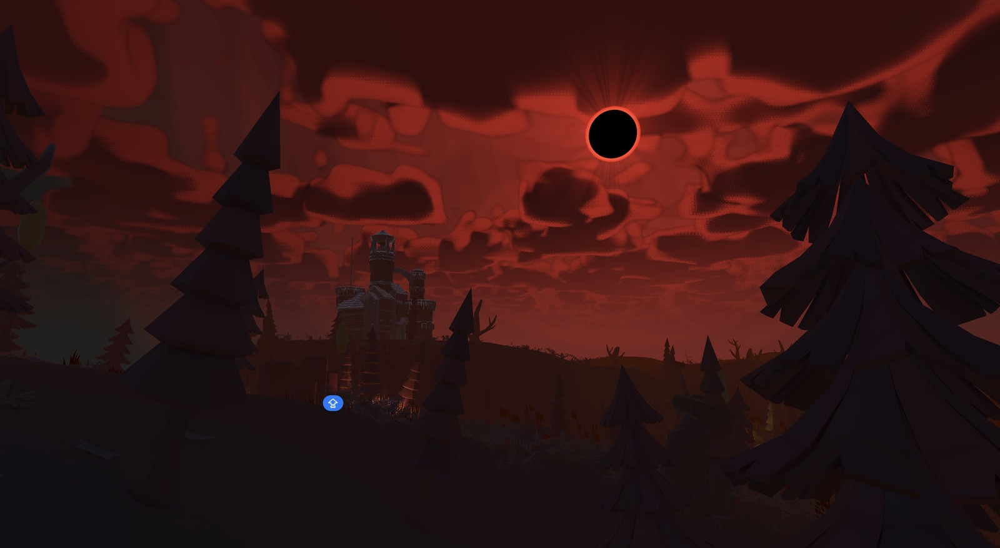
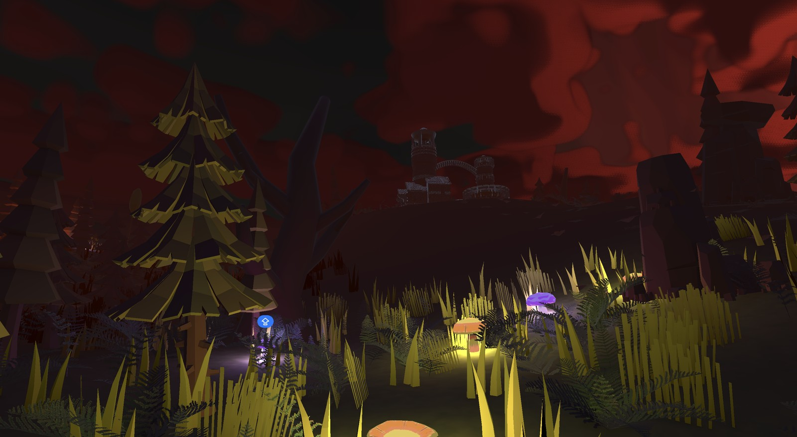
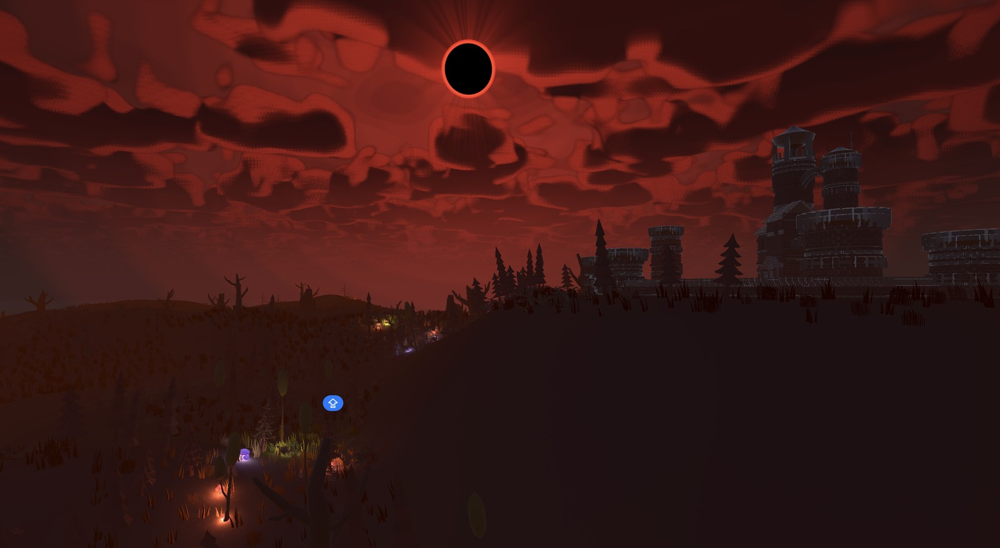
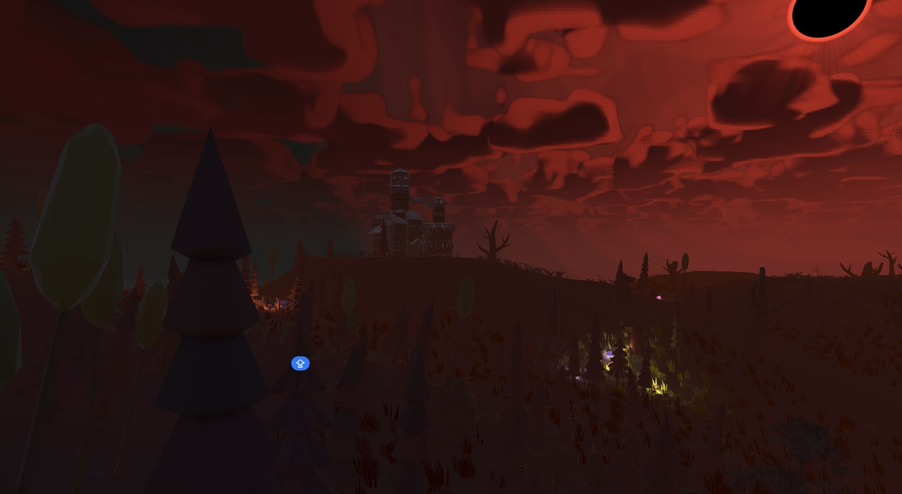

# Eclipse

A single-player third-person melee game built in Unity 6 (6000.3). You fight through a forest
under a dead sun, carrying the only light left.

## Light is your health

There is no health bar. The player carries a lantern of thirty points of light, drawn bottom right,
and every point is something you can lose or spend:

- **Being hit takes light.** A blow costs one orb under 20 damage, two from 20, three from 30.
- **Every swing costs light too** — so a miss is a point down, and a landed hit roughly breaks even.
  The last orb is never spendable, so you can never swing your own lantern out.
- **Hurting an enemy knocks light loose.** It falls on the ground as orbs that hang there bobbing
  until you walk over them and take the light back.
- **Light at zero is death.**

That makes the dark the real opponent: the further you push, the less you can see, and standing
still to recover is not an option because the light on the floor is the light you just lost.

Glow mushrooms are the other source. They burst into orbs when they are broken, so the forest
itself is a supply line — the bright patches on the ground are the ones worth walking through.

## The enemies carry darkness

The creatures are the same system read backwards. Their weapons hold an `Unlight` — a light with a
negative colour, which URP's additive light loop *subtracts* from whatever is near it — so a swing
takes illumination out of the scene instead of adding it. The blade drags a streak of pitch black
behind it, built from the same trail code as the player's slash of light and multiplied into the
frame rather than added to it.

The consequence is the thing worth playing for: black on black cannot be seen, so an enemy's swing
reads exactly as far as your own light reaches.

Two of them share the world. The **crumpy** is the common one — quick, hooked khopesh, long arms.
The **alien** is rare, slow, heavily armoured, and sees furthest. They stand in camps across the
world and in the castle garrisons.

## The world

One handmade world, `Scenes/World/NatureWorld.unity` — terrain, a procedurally scattered vegetation
system, enemy camps and a ruined castle, all under a permanently eclipsed sky.

## Running it

1. Open the project in Unity **6000.3.11f1**.
2. Open `Scenes/Core/Bootstrap.unity` and press Play, or load
   `Scenes/World/NatureWorld.unity` directly to drop straight into the world.

| | |
| --- | --- |
| Move / look | `WASD`, mouse |
| Swing, or use the held item | Left mouse |
| Jump / sprint | `Space`, `Left Shift` |
| Interact | `E` |
| Weapon wheel | Hold `Q` |

Holding `Q` slows the game and hands the look input to a pointer that steers round the dial instead
of the camera; letting go equips the hotbar slot it was over.

## Credits

The dragon on the main menu is **"Mountain Dragon"** by Alexey Zaika and the torch is
**"Torch"** by milacetious, both from Sketchfab under
[CC BY 4.0](http://creativecommons.org/licenses/by/4.0/) and both modified. Animation comes from
Adobe Mixamo and Kevin Iglesias' *Human Animations*, the vegetation wind from Nicrom's *Low Poly
Wind*, and the camera shake from First Gear Games' *Smooth Camera Shaker*.

Every asset here that was not made for this project, with what each licence asks of us — and the
handful whose origin still has to be traced before anything ships — is in
[THIRD_PARTY_NOTICES.md](THIRD_PARTY_NOTICES.md).

## Notes

- The screenshots above are Scene-view captures from the editor, not a built player.
- There is no audio yet. Everything you see is silent.
- Architecture notes live in [docs/architecture/](docs/architecture/).
